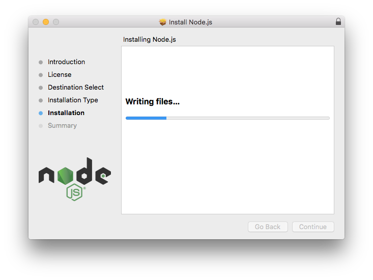
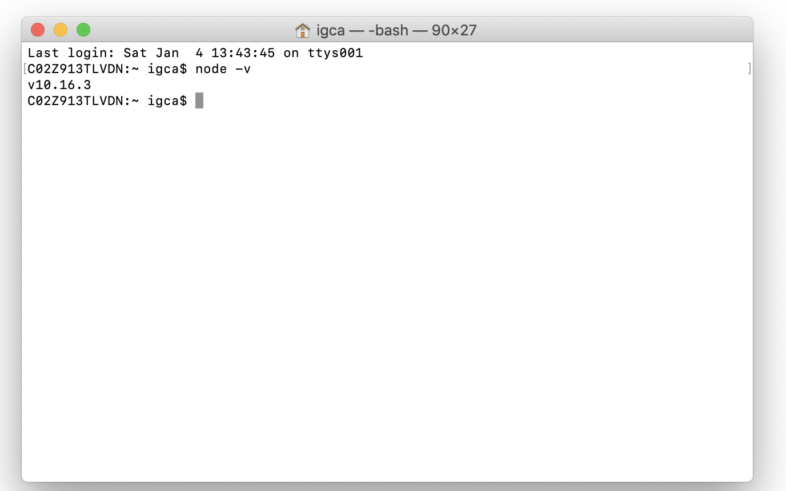

# Installation

## Installation

### Server requirements

GOAT has minimal system requirements. As it is a **_NODE.JS_** Framework, getting started is as easy as installing **_NODE.JS_** on your machine. Even when it could be possible to develop using **_DOCKER_**, we recommend having node installed to ease the process. We will use **_DOCKER_** for deployment and other purposes.

#### Installing Node.JS

To install NODE.JS in your environment follow these instructions, depending on you OS.

<!-- tabs:start -->

#### ** x **

Select your OS :fas fa-arrow-up:

#### ** MAC **

- Visit [NodeJS download](https://nodejs.org/en/download/) page and get the LTS version for MAC


- Once the download is ready, open FINDER and double click on the installation icon. The installation dialog should open.

- Go through the installation process



- Once completed, open the Terminal by pressing Command+Space to open Spotlight Search and entering Terminal then pressing Enter.


- Verify that Node.js is installed correctly by running

```bash
node -v
```



#### ** PC **

Check out [Node Docs](https://nodejs.org/en/download/)

#### ** Linux **

Check out [Node Docs](https://nodejs.org/en/download/package-manager/)

<!-- tabs:end -->

#### Installing GOAT

GOAT can be used either with NPM or YARN. So, before using GOAT, make sure you have at least one of them installed on your machine.
Open your terminal and follow this steps

Using NPM

```bash
npm install --global @goatlab/goat-cli

```

Once installed, your machine should have the goat command available. Verify the installation by running

```bash
goat --help

```

You should see the available commands that goat-cli provides.


The `goat new` command will create a new GOAT project in the directory you specify. For instance, `goat new app` will create a directory named app containing a fresh GOAT installation with all of GOAT's dependencies already installed

```bash
goat new app

```

#### Local Development Server

As we already have **_NODE.JS_** installed in our machine, starting the development server is as easy as running `goat serve` inside the project's folder. This command will start the API server at `http://localhost:3000` and the API manager at `http://localhost:80`

```bash
goat serve

```
