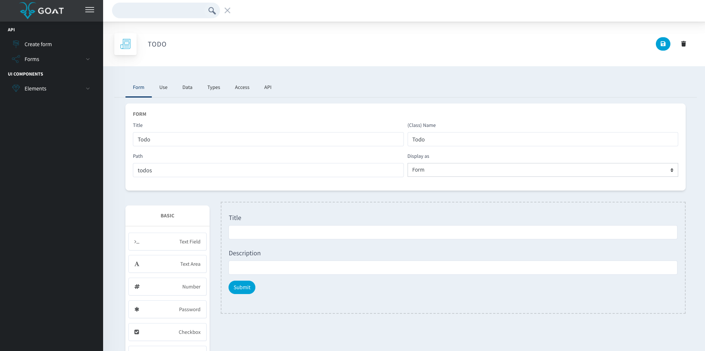
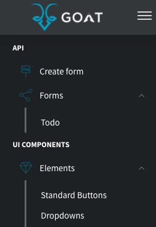
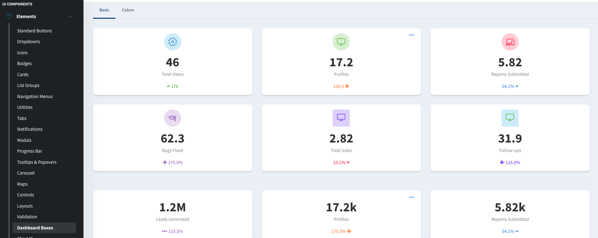
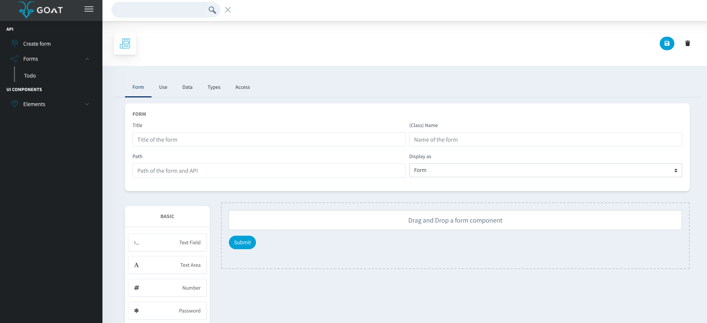
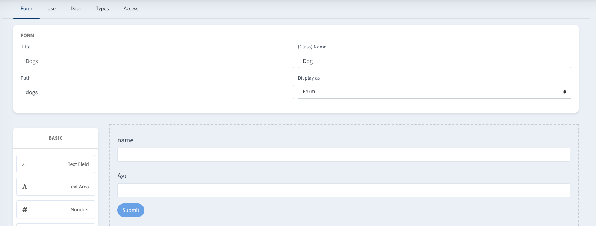
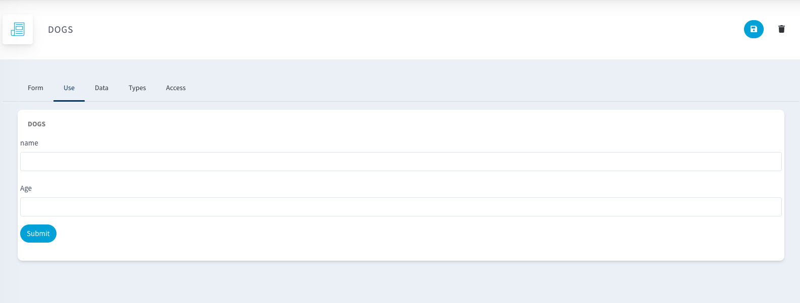
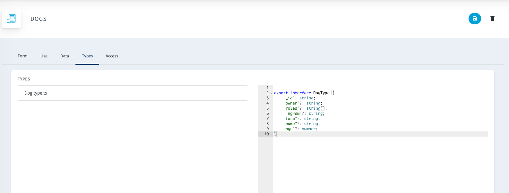
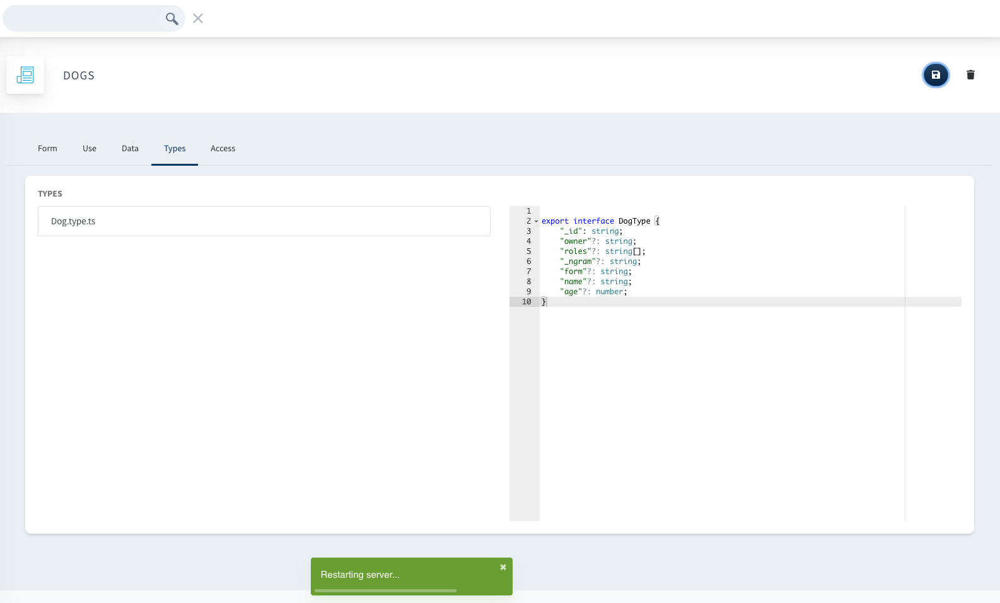

# API Builder

> Drag and drop beautifully designed components to generate your backend.

## Introduction

Developer, meet the API builder. Builder, this is your dev.

The API Builder is meant to be used on your **dev environment only**, there are no users, no login, just you and your code. **_Manager_** makes writing and visualizing backend code more approachable. Once you have the code already, just version it, put it on your CI/CD pipeline and then to production. Just like any other piece of code.

> **Do not** expose **_Manager_** on your production environment.

Let´s introduce the different parts of **_Manager_**

## Side Bar

### Forms

On your sidebar you will have a shortcut to create new forms/apis and you will also have quick access to your previously created forms.

Every form that you create, will generate a new **REST** resource and therefore, a ready to **_Goat_** API.

### UI Components

**_Manager_**´s UI was build using the open source version of **_ArchitectUI_** and we will (Spoiler alert) introduce some App started kits based on these component´s. The idea is that you will be able to navegate trough them and then use them in your own frontend.

## Form Builder

The Form Builder is **_Manager_**´s core, it is basically the Open Source version of **_Form.io_** with some extra love.

### Form creation

You will be able to manage the path of your API and to drag and drop different components to generate new attributes. We will cover different use cases later.

### Using the Form

Once you have created your base Form, you will be able to use it right away (No coding required)! And at the same time, you will be able to use the generated form inside your frontend apps

### Types

While you have fun dragging and dropping, **_Manager_** is busy making sense out of what you do🐐, and will create the **Typescript** definition of your Form structure.

Some of the attributes that you see in there are generated by default by **_Manager_** . Manager Supports nested and related Forms, so don´t be afraid or adding as many array and object based definitions to your forms, we **_Goat_** you cover 🐐

### API

Once you save your Form, the backend will react to this and trigger a server restart. Is at this point that we trigger the generation of the code, so probably you will need to wait a couple seconds to appreciate the magic.

Once the server restarted, you now will have access to the API tab. In there you will see a full working Swagger implementation with all of your endpoints ready to be tested.
