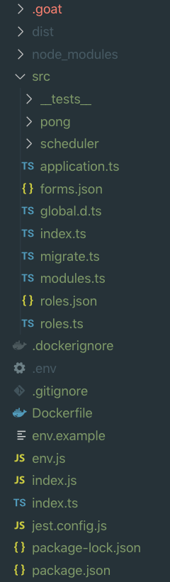

# Directory Structure

## Introduction

The default Goat application focuses on folder readability helping you quickly find things as you code. The folder structure is based on **_NestJS_** that, at the same time, has a lot of **_Angular_** inspiration. Because Goat auto-generates code, this folder structure cannot be changed (TRADE OFFS!)

## Folders

The overall structure for this version looks like this.

### .goat

The `.goat` directory contains everything that is Goat related and that probably you **SHOULD NOT** touch. In there you will find a `Manager` build and other helpers that will allow us to generate code for you. This is our way of staying out of your code.

### dist

Loopback needs to be build every time you want to serve it. All final build of your project will be available at the dist folder.

### node_modules

You know this one already, all of the NPM packages you install will live in here.

### src

This is where your code lives, if you want to include a custom route, or all generated routes will be placed here. For every API resource, **_Goat_** will generate a specific resource folder for you and the name of that folder will be the same as the API path that you define. We will continue on this topic later.

### \_\_tests\_\_

All test helpers will be in here. Even when you can use this folder to put all of your tests if you want, we recommend having your test inside the specific resource folders as close as possible to the `Class / API` that you are testing. We will cover more on the **Testing** section

### pong

Just a resource example to get you started with a custom route. After you check this example, you might want to delete it or maybe just change the names and content.

### scheduler

At the scheduler folder you will be able to write all `JOBS` that your a app needs to `schedule` to run at a given moment. We will cover this on the **Jobs** section

## Files

There are two main files that are the base of all `magic` behind Goat. Let´s check them out now.

### forms.json

In here you will find all **Form.io** forms generated using **Manager**. Form.io has a tone of logic on it´s own, so **Goat** just stores the full Form.io json form as a `string` to keep typescript happy, without having to manually parse everything. Based on these forms, **Goat** will generate your api every time you start the application.

As a main difference from **Form.io**, **Goat** stores the forms in your code instead of a database, making your API ready to go even when there is no database connected. Is very handy for portability reasons.

Both approaches have pro´s and con´s. Storing at a DB level will give you flexibility to change your API without deploying code. But storing it at the code level will help you properly version your code base without the need to rely on a database backup. We know that it is a more traditional approach, but we like it 🐐

### roles.json

**Goat** decided that the Application **Roles** are also first class citizens in Goat´s structure. Throughout your code, it is likely that you will try to reference some of the roles that you manage at the application, therefore **Goat** stores them in your code, not in the database. The roles will also be available for you as a `enum`. No more string checking!
