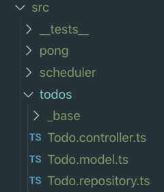
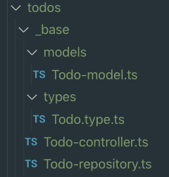

# Resources

A resource defines a set of **_API_** endpoints in your application. Resources follow the **_REST_** convention and all basic API´s endpoints will be auto-generated when using **_Manager_**

When working with **_Goat_** you are **NOT** forced to use Manager to generate your endpoints. We know that even when it is convenient for 80% of the cases, sometimes you just want a single route or custom logic over the code. So other than the folder structure, you can go ahead an use your **_Loopback / NestJS_** backend as you like. Remember that **_Goat_** is not the framework here!

## The mandatory example

Why not? Let´s build a TODO API.
So basically when you generate a TODO resource using **_Manager_**, **_Goat_** will take care of creating the proper folder structure for you. In this case, we want our todo API to use the `/todos` path, therefore the folder and file structure for the resource would look like this.

### Main folder

The corresponding path of the resource will became a folder in our code. In this case, under `src` you will find `todos`

### MVC - V + R

Remember your good old **MVC** patter? Yes, is still valid, but with a little twist. **_Goat_** backends will never contain a view, so you can scratch right away that **V** from **MVC**. An just to make **M** and **C** feel better, we will add a friendly **R**.

**_Goat_** uses dot notation to differentiate between models, controllers and repositories. So no complicated folder structures, just `<ResourceName>.<model|repository|controller>.ts`

#### Model (M)

The model will take care of defining the structure of the data that we want to manage. Here is where we define all `attributes` that our resource must manage and add some first level validation for our API. Basically the model will define everything that we will be able to store in our database (if we are using one!).

#### Controller (C)

After the framework has decided to where in the application should it route the incoming request, the controller is the "first" point of contact between the request and the code. Of course, we can always add things in the middle (Your guess is right, a `middleware`) but let not get ahead of ourselves.

The basic rule with controllers is that they should hopefully not have a tone of logic and, that they should act as a `broker` telling the different pieces of our software what to do given the content of the request.

Basically the overall view of all involved steps of your logic should be present here, but you should put the heavy load somewhere else. P.S: No kitties will die if you have a controller that is doing too much but just try to keep it simple.

#### Repository (R)

So if you can´t put logic in your controllers. Where should you? Quick answer, your repositories.
The repository will take care of the implementations of all methods that you mentioned on your controller. For instance, if we are working with MongoDB, here is where we actually call the mongo library or in our case, the **ORM** that is connected to Mongo to do it´s thing.

If in the future you wanted to change databases and you have a pretty tightly couple repository with your DB, you can just Swap the repository and leave the controller as it is (It is never that easy, but let´s pretend it is).

### \_base

And the secret ingredient of this recipe! The \_base folder will include all auto-generated code, we would suggest not to change files here unless you are planning to not use the generators again (Which takes all the fun from using **_Goat_**...Bahhh!🐐)
All files inside the `_base` folder will be recreated every time you restart the backend. Let´s check what we have in there.

For **_Goat_**´s sake! What the heck is this? Seems that we have a lot of duplicated things! No, no. Let us explain.

The `_base` folder will contains all **Parent** classes that the `TODO` resource will extend. With this approach, you will be able to completely control your files without the need to constantly see all the boilerplate.

> If you like what you see, keep it, if you don`t, just overwrite it!

Do you need to add custom properties that you don´t want to display on the json forms?

> Add it on your extended model

Do you want to have custom routes other than the ones that **_Goat_** generated?

> Add it on your extended controller

Do you want to re-defined a controller method?

> Overwrite it on your extended controller

I hope that by now you got the point!

#### types

One of the most helpful features of using **_Goat_** is that you will get the full `TS` definition of your resources. The benefits of having these definitions is that you can re-use them wherever you like because they do not depend on a given ORM.

Now that you know the basics, let´s **_Goat_** to the next section and learn about **_Manager_**.
