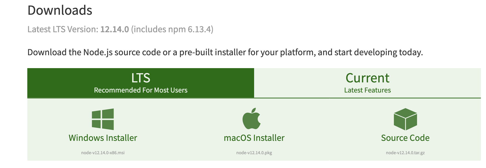

# Installation

## Installation

### Server requirements

GOAT has minimal system requirements. As it is a **_NODE.JS_** Framework, getting started is as easy as installing **_NODE.JS_** on your machine. Even when it could be possible to develop using **_DOCKER_**, we recommend having node installed to ease the process. We will use **_DOCKER_** for deployment and other purposes.

#### Installing Node.JS

To install NODE.JS in your environment follow these instructions, depending on you OS.

<!-- tabs:start -->

#### ** MAC **

- Visit [NodeJS download](https://nodejs.org/en/download/) page and get the LTS version for MAC



- Once the download is ready, open FINDER and double click on the installation icon. The installation dialog should open.

- Go through the installation process


- Once completed, open the Terminal by pressing Command+Space to open Spotlight Search and entering Terminal then pressing Enter.


- Verify that Node.js is installed correctly by running

```bash
node -v
```


#### ** PC **

Visit https://nodejs.org/en/download/

#### ** Linux **

Ciao!

<!-- tabs:end -->
