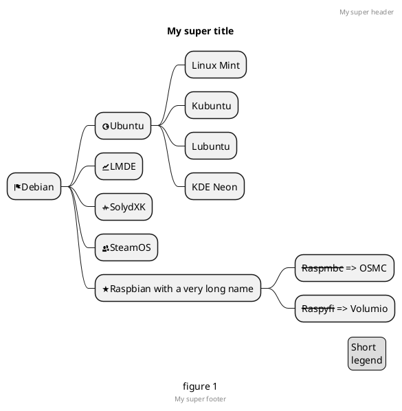
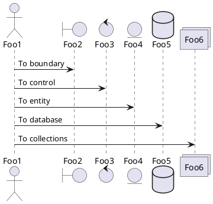

# Installation

## Installation

### Server Requirements

#### Via Laravel Installer

First, download the Laravel installer using Composer:

```javascript
var s = "JavaScript syntax highlighting";
alert(s);
```

Now we will watch an amazing video

 <iframe width="560" height="315"
src="https://www.youtube.com/embed/MUQfKFzIOeU" 
frameborder="0" 
allow="accelerometer; autoplay; encrypted-media; gyroscope; picture-in-picture" 
allowfullscreen></iframe>

And now check this diagram

### Section X





## And now we have another example :fas fa-home fa-fw:

<!-- tabs:start -->

#### ** English **

Hello!

#### ** French **

Bonjour!

#### ** Italian **

Ciao!

<!-- tabs:end -->
