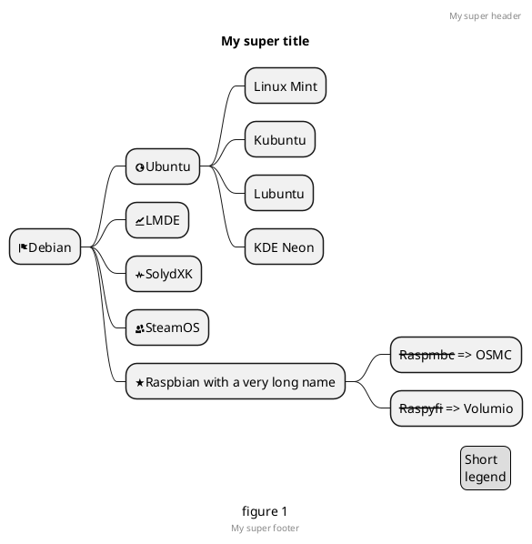

# Kitchen title

## Kitchen subtitle

In here you will be able to see all the components that you can use to generate amazing docs using Docsify.

### This is a section title

#### This is a text section title

!> **Time** is money, my friend!

?> _TODO_ unit test

- [ ] foo
- bar
- [x] baz
- [] bam <~ not working
  - [ ] bim
  - [ ] lim


<details>
<summary>Self-assessment (Click to expand)</summary>

- Abc
- Abc

</details>

First, download the Laravel installer using Composer:

```javascript
var s = "JavaScript syntax highlighting";
alert(s);
```

### Embed videos

You can embed videos by using HTML

<!-- tabs:start -->

#### ** Result **

 <iframe width="560" height="315"
src="https://www.youtube.com/embed/MUQfKFzIOeU" 
frameborder="0" 
allow="accelerometer; autoplay; encrypted-media; gyroscope; picture-in-picture" 
allowfullscreen></iframe>

#### ** Code **

```html
<iframe
  width="560"
  height="315"
  src="https://www.youtube.com/embed/MUQfKFzIOeU"
  frameborder="0"
  allow="accelerometer; autoplay; encrypted-media; gyroscope; picture-in-picture"
  allowfullscreen
></iframe>
```

<!-- tabs:end -->

### Diagrams

All Diagrams use the \```plantuml``` sections. Check more details on [PlantUml](https://plantuml.com/en/) 's site

<!-- tabs:start -->

#### ** Result **



#### ** Code **

```markdown
@startmindmap
caption figure 1
title My super title

- <&flag>Debian
  ** <&globe>Ubuntu \*** Linux Mint
  **_ Kubuntu
  _** Lubuntu
  **\* KDE Neon
  ** <&graph>LMDE
  ** <&pulse>SolydXK
  ** <&people>SteamOS
  ** <&star>Raspbian with a very long name \*** <s>Raspmbc</s> => OSMC
  \*\*\* <s>Raspyfi</s> => Volumio

header
My super header
endheader

center footer My super footer

legend right
Short
legend
endlegend
@endmindmap
```

<!-- tabs:end -->

### Tabs

<!-- tabs:start -->

#### ** English **

Hello!

#### ** French **

Bonjour!

#### ** Italian **

Ciao!

<!-- tabs:end -->

### FontAwesome :fas fa-home fa-fw:

```markdown
:fas fa-home fa-fw:
```
